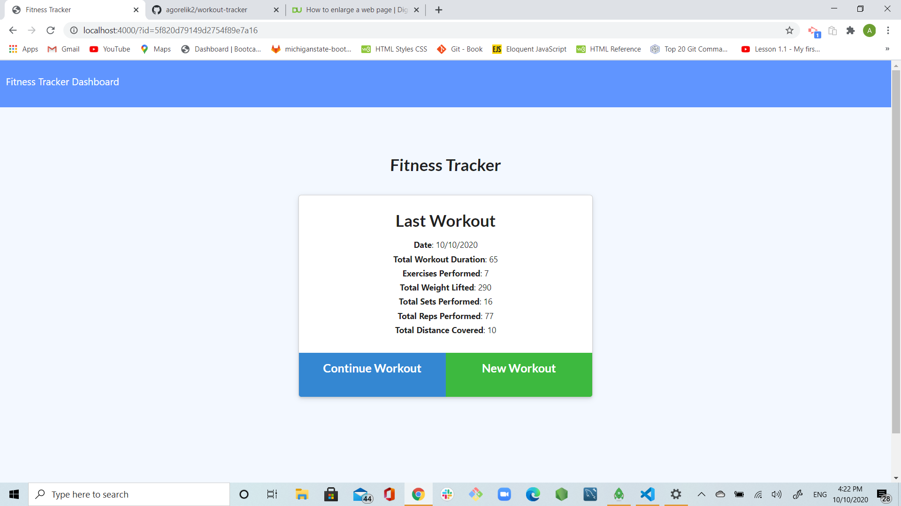
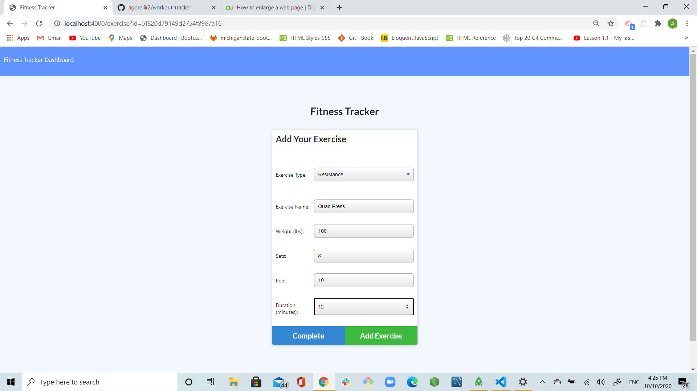
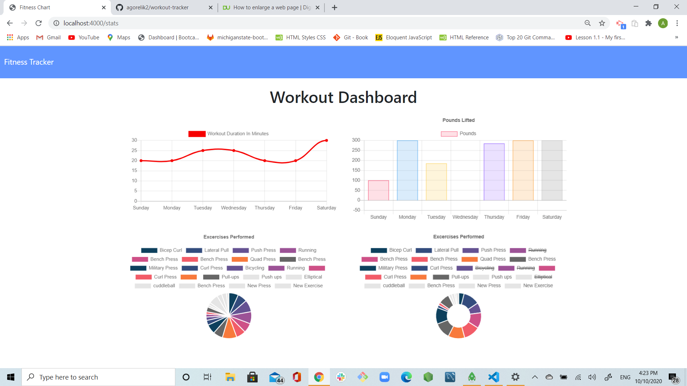

# workout-tracker

## Username:

agorelik2

## Title:

Workout Tracker

[Link to the deployed application](https://workout-tracker-alina.herokuapp.com/)

## Table of Content

- [Description](#description)
- [User Story](#user-story)
- [Functionality](#functionality)
- [Database](#database)
- [Screen Shots](#screen-shots)
- [Development](#development)
- [Installation](#installation)
- [Dependencies](#dependencies)
- [Built With](#built-with)
- [Repo](#repo)
- [Demo](#demo)
- [Developer](#developer)

## Description

This application helps you better track your resistance and cardio workouts in order to reach your fitness goals. The stats page will allow you to see graphs representing your performance overtime.

## User Story

- As a user, I want to be able to view create and track daily workouts.
- I want to be able to log multiple exercises in a workout on a given day.
- I should also be able to track the name, type, weight, sets, reps, and duration of exercise.
- If the exercise is a cardio exercise, I should be able to track my distance traveled.

## Functionality

- User is presented with the details of his last workout, and is able to choose between creating a new workout or continueing the existing workout
- Once the selection is made, user is presented with a new screen that allows him to enter the details for the new exercise or workout. Fist, user is required to select a type of the new exercise. The two options are "Resistance" and "Cardio"
- User can enter the details for the exercise based on the type of the exercise selected before.
- User can select either "Add Exercise" or "Complete" option
- User can see the graphic representation of workout tracker if he clicks on the "Fitness Tracker Dashboard" link

## Database

The app utilizes a Mongo database with a Mongoose schema. The schema has only one collection called 'workout' that is created and stored in models/workout.js.

```
const WorkoutSchema = new Schema({
    day: {
      type: Date,
      default: () => new Date(),
    },
    exercises: [
        {
          type: {
            type: String,
            trim: true,
            required: "Enter workout type: resistance or cardio",
          },
          name: {
            type: String,
            trim: true,
            required: "Enter the name of the exercise",
          },
          duration: {
            type: Number,
            //required: "Enter an exercise duration in minutes",
          },
          weight: {
            type: Number,
          },
          reps: {
            type: Number,
          },
          sets: {
            type: Number,
          },
          distance: {
            type: Number,
          },
        }],
});
const Workout = mongoose.model("Workout", WorkoutSchema);

module.exports = Workout;
```

## Screen Shots

User is presented with the details of his last workout, and is able to add a new exercise or create a new workout


User can enter the details for the new Cardio or Resistance exercise


User can see the graphic representation of workout tracker if he clicks on the "Fitness Tracker Dashboard" link


## Development

I worked on 5 files: server.js, models/index.js, models/workout.js, routes/api-routes.js & routes/html-routes.js. Once I created the server.js and tested I was able to connect to the server on port 4000, I proceeded working on the routes. As soon I was able to reach these pages on the localhost, I continued working on the models files to allow the DB to be created and to be ready to store data.
As soon the local environment was working and there no further errors, I pushed to heroku and ensured, I was able to use it and it was fully functional.

## Installation

To use this application locally:

- Install Node.js on your computer.
- Use `npm install` to install all the dependencies, see [Dependencies](#dependencies) for the complete list
- Use `npm run seed` to populate the database with initial records
- Open a terminal, navigate to the folder where **_server.js_** is located and type: `node server.js`
- Once the server is running, open a browser and navigate to localhost:4000 or the port you have selected

## Dependencies

    "express": "^4.16.3",
    "mongoose": "^5.3.16",
    "morgan": "^1.9.1"

## Built With

- [VScode](https://code.visualstudio.com/)
- [Gitbash](https://gitforwindows.org/)
- [node.js](https://nodejs.org/en/)
- [express.js](https://expressjs.com/)
- HTML, CSS, JavaScript, Mongo DB, Mongoose

## Repo:

https://github.com/agorelik2/workout-tracker

## Demo:

https://workout-tracker-alina.herokuapp.com/

## Developer

    Alina Gorelik
